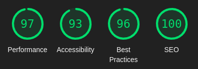

# Tulfa App

Tulfa App is a modern web application built with Vite and React. It showcases a responsive and interactive user interface with features like image sliders, modals, and reusable components. The app is designed to be modular, scalable, and easy to maintain.

## What i have Done

- **Responsive Design**: Built with mobile-first principles for a seamless user experience across devices.
- **Reusable Components**: Modular components like `ResponsiveImage`, `VideoPlayer`, and custom hooks for easy reuse.
- **Interactive Elements**: Hard Coded auto-sliders, manual sliders, and modals and animation.
- **Performance Optimized**: Uses lazy loading, modern image formats (WebP), and Convert the images to CDN.
- **Custom Hooks**: Includes reusable hooks like `useImageSlider`, `useModal`, and `useScrollTrigger`.
- **Higher order component**: use a advanced React design pattern like the higher order component
- **Code Refactoring concept**:that makes the component Smaller and Readable and faster (performance and maintenance) 
- **Css**: use Variables and  add a global className for animations in the app.css to minimize the code and order the css in a good structure 

## The App After the LightHouse Test:



## Folder Structure
```
    └── 📁src
        └── 📁assets
            └── Svg.jsx
        └── 📁Components
            └── 📁ComponenName
                └── ComponenName.css
                └── ComponenName.jsx
                └── index.jsx
        └── 📁CustomHooks
            └── useCustomHooks.jsx
        └── 📁HOC
            └── HigherOrdeComponent.jsx
        └── 📁Layouts
            └── Main.jsx
            └── 📁LayoutName
                └── LayoutName.css
                └── LayoutName.jsx
                └── index.jsx
        └── 📁ReUsableComponents
            └── 📁ReUsableComponentName
                └── index.jsx
                └── ReUsableComponentName.css
                └── ReUsableComponentName.jsx
        └── 📁Shared
            └── 📁navbar
                └── index.jsx
                └── navbar.css
                └── navbar.jsx
        └── App.css
        └── App.jsx

    └── .gitignore
    └── eslint.config.js
    └── index.html
    └── package-lock.json
    └── package.json
    └── README.md
    └── vite.config.js
```
